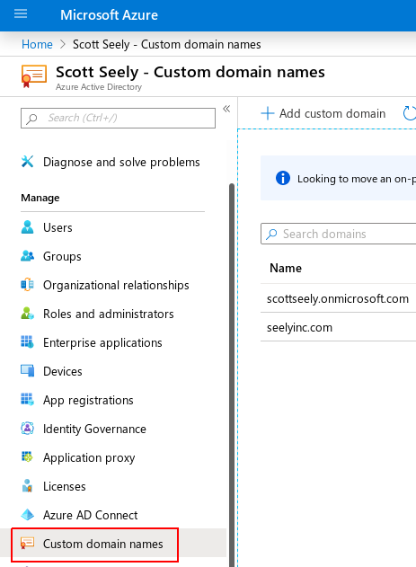
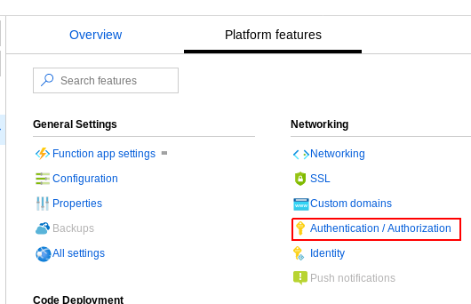
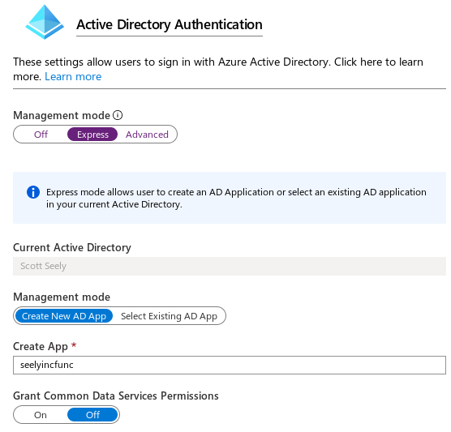
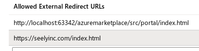
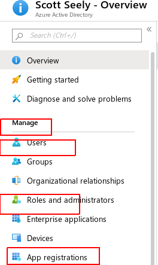
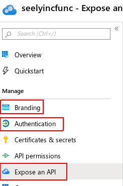
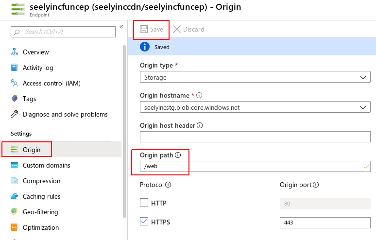
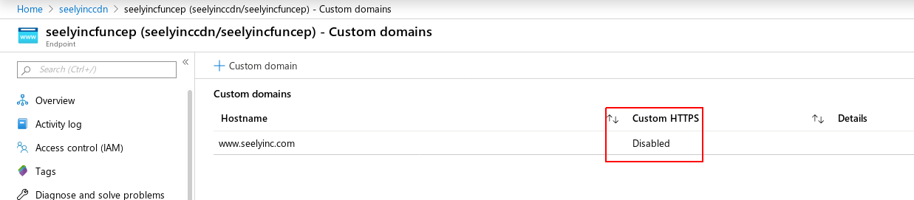

# Overview
This project shows how to build an Azure Marketplace Portal
and webhook using a serverless setup. The scripting used to
deploy the application assumes a bash shell. The application 
front end follows a minimalist design with a goal of 
making it easier for a web developer to customize the 
UI to meet their company styling needs. The only external 
JavaScript libaries in use are:

* [jQuery](https://jquery.org/): Used to do simple manipulation of the web page and send XmlHttpRequests. 
* [Azure App Insights](https://docs.microsoft.com/en-us/azure/azure-monitor/app/app-insights-overview): Used to track behavior on the deployed portal page.

This sample shows how to setup a SaaS Azure Marketplace Portal page using a custom domain. To follow along,
it is assumed that you have a certificate which minimally supports two names:
1. yourdomain.com
2. www.yourdomain.com

Wildcard certificates, such as *.yourdomain.com, definitely work. You will need the certificate in the
form of a .PFX. 

# Environment requirements
You will need some packages installed on your machine. The 
scripts and other pieces all assume a bash environment. 
Bash environments are available on [Linux](https://www.cyberciti.biz/faq/how-to-change-shell-to-bash/), [Windows](https://docs.microsoft.com/windows/wsl/install-win10), and [macOS](https://www.howtogeek.com/444596/how-to-change-the-default-shell-to-bash-in-macos-catalina/). 

## Required software
The following packages must be installed in order to deploy your portal:
* [Terraform](https://www.terraform.io/downloads.html): Deploys to Azure. 
* [Azure Command Line Interface](https://docs.microsoft.com/cli/azure/install-azure-cli?view=azure-cli-latest): Used for interacting with Azure; some functionality is in the CLI but not in the portal.
* [Azure Functions Core Tools](https://docs.microsoft.com/azure/azure-functions/functions-run-local#install-the-azure-functions-core-tools): Allows for local development and debugging. Also used to upload to Azure.

## Optional software
* [pyenv](https://github.com/pyenv/pyenv): For the Python back-end example, this is a handy way to install a Python environment which is compatible for use with Azure Functions Core Tools. If you have other mechanisms, great!
* [Visual Studio Code](https://code.visualstudio.com/): While you can certainly use your tool of choice, VS Code has handy integrations for all things Azure. In our case, it integrates well with Azure Functions Core Tools and makes debugging easy. 

# Get the base solution running

## Base login instructions
To login to Azure and select a default subscription, do the following from the command line:
1. Run `az login`
2. From the output, set the active subscription with `az account set -s [subscription UUID]`

## Add the Azure CDN as a secureable application
The scripts will require that the Azure CDN is a selectable entity from your IAM configuration when
you configure Key Vault a bit later. This is a one time operation on the subscription. To do this:
1. Login using [these steps](#Base-login-instructions).
2. Run `az ad sp create --id 205478c0-bd83-4e1b-a9d6-db63a3e1e1c8`

## Configure the deployment service principal and setup `variables.conf`
The Terraform scripts and other login scripts use a service principal login instead of an 
interactive login. This was done to allow for a CI/CD pipeline to be built around this sample. 

Please note that `variables.conf` should never be checked into source control. This file contains
secrets which, if exposed to a github crawl, would open your resources to misuse by others. 
All the values stored in variables.conf may also be stored as environment variables in a build
environment. If you choose to do this, make sure to remove references to variables.conf from 
`/src/deployment/deploy.sh`.

To create the service prinicipal and configure the solution, follow these steps.

1. Login using [these steps](#Base-login-instructions).
2. Create the service principal: `az ad sp create-for-rbac --role="Contributor" --scopes="/subscriptions/[SUBSCRIPTION_ID]"`. This generates output like:
``` JavaScript
{
  "appId": "<app UUID>",
  "displayName": "azure-cli-<YEAR-MONTH-DATE-HOUR-MINUTE-SECOND>",
  "name": "http://azure-cli-<YEAR-MONTH-DATE-HOUR-MINUTE-SECOND>",
  "password": "<password as a UUID>",
  "tenant": "<tenant UUID>"
}
```
Save this output for use in step 5.

3. Open the file `/src/deployment/variables.conf.template`. 
4. Save the file `/src/deployment/variables.conf.template` as `/src/deployment/variables.conf`.
5. Decide what region to deploy to. To get a list of regions, use `az account list-locations | jq '[.[] | {name: .name, displayName: .displayName}]'`. You will use the `name` in the next step when filling in `resource_group_location`.
5. Set the values in variables.conf.template by copying values from the output of the service principal creation as follows (Note: we will fill in the storage_access_key [in a moment](#Setup-Terraform-shared state-management-for-deployments)):
``` bash
service_principal_client_id=[name]
service_principal_client_secret=[password]
azure_ad_tenant_id=[tenant]
azure_subscription_id=[SUBSCRIPTION_ID]
resource_group_location=[region name]
base_name=[base name to be used for created resources, eg. contosoinc]
domain_name=[yourdomain.com (eg. the name of the domain associated with your certificate)]
storage_access_key=[access key for the Terraform state storage account]
```

6. Save `/src/deployment/variables.conf`.

## Setup Terraform shared state management for deployments.
Because this is designed to run in a CI/CD pipeline, we want the Terraform state information to 
be persisted to a shared location. For this, we want to setup a connection to Azure Storage. 

1. From the `/src/deployment/terraform_state` directory, run `terraform init`. This initializes your Terraform environment in this directory. You only need to do this step once.
1. Run `/src/deployment/terraform_state/deploy.sh`. Output from this command will look something like this:
```
Outputs:

properties = [STORAGE KEY]
```
2. Open `/src/deployment/variables.conf`. Remote state info doesn't "do" variables, so we'll be entering this in manually. 
3. Set `storage_access_key` to `[STORAGE KEY]`
4. Save `/src/deployment/variables.conf`.

## Add your domain to your Azure Active Directory Tenant

1. Open up the [Azure portal](https://portal.azure.com/) and open your AAD tenant. 
2. Select _Custom domain names_ as shown below.



3. Select _+ Add custom domain_.
4. Add the domain. This should match the domain you use in your certificate.
5. Go to your registrar and add the appropriate TXT record. Once done, click _Verify_.

You now have your custom domain registered.

## Deploy the basic application

Now, we will deploy the application to Azure. 

1. From the `/src/deployment` directory, run `terraform init`. This initializes your Terraform environment in this directory. You only need to do this step once. When done, the state file will be stored based on the setup from [Setup Terraform shared state management for deployments](#Setup-Terraform-shared-state-management-for-deployments).
2. From the `/src/deployment` directory, run `deploy.sh`. This will provision the marketplace portal. 

Once complete, there are some manual steps we need to perform to setup the security, SSL, and custom domains
for the application. 

## Configure Azure Active Directory (AAD) with the function app.

The function application offers a feature called 
[EasyAuth](https://docs.microsoft.com/azure/app-service/overview-authentication-authorization). 
This is a simplified endpoint that handles a lot of the AAD complexities. We will set this up next.
For this, you need to open the Functions Application named `[base_name]func`. Follow these steps to setup
AAD authentication.
 
1. Select _Platform features_. 
2. Under _Networking_, click on _Authentication / Authorization_.



3. Set _App Service Authentication_ to _On_.
4. Set _Action to take when request is not authenticated_ to 
_Log in with Azure Active Directory_.
5. Click on _Azure Active Directory_.
6. For _Management mode_, select _Express_. Note: we will return here in a bit. We
are using the "easy" path to configure things correctly.
7. Leave the defaults as is and click on _OK_.



8. Add the following to _Allowed External Redirect URLs_:
    * Localhost testing: `http://localhost:63342/azuremarketplace/src/portal/index.html`
    * Public website: `https://[your domain]/index.html`



9. Click on _Save_.

10. Navigate to [Azure Active Directory](https://portal.azure.com/#blade/Microsoft_AAD_IAM/ActiveDirectoryMenuBlade/Overview) within the portal. 

11. Select _App Registrations_.



12. Select your portal app, `[base_name]func`. We are going to update the following items, 
in this order:
    * Branding
    * Expose an API
    * Authentication



13. On _Branding_, set the various fields to appropriate values. This includes
    updating the Publisher Domain to `https://[your domain]`.
14. On _Expose an API_, change the Application ID URI to 
    `https://[your tenant].onmicrosoft.com/[base_name]func`.
15. On _Authentication_, for _Supported account types_, do the following:
    * Select _Accounts in any organizational directory (Any Azure AD directory - Multitenant)_. 
    * Click on _Save_.

16. Open the Functions Application named `[base_name]func`.
17. Select _Platform features_. 
18. Under _Networking_, click on _Authentication / Authorization_.
19. Click on _Azure Active Directory_.
20. Set _Management mode_ to _Advanced_.
21. Clear _Issuer Url_. This allows the application to use the common login, required
for multi-tenant AAD authentication.
22. Click on _OK_, then _Save_. 

## Update the endpoint at the CDN

Here, we are going to update the CDN endpoint mapping our storage account containing our HTML, 
CSS, and JavaScript. Once you are done with this piece, it can take 10 minutes for the files
to propagate to the CDN.

1. From the [Azure portal](https://portal.azure.com), find the CDN named `[base_name]cdn.
2. From the endpoint list, select the endpoint named `[base_name]funcep`.
3. Under _Settings_, select _Origin_.
4. Set the _Origin path_ to `/web`. 
5. Click on _Save_.



6. Select _Custom domains_.
7. Click on _+ Custom domain_.
8. Set the _Custom hostname_ to `[your domain]`. You can also use a different
value, like `portal.[your domain]` or `azuremarketplace.[your domain]`. 
    * To complete this, you will also need to add an CNAME record in your DNS to 
        point to the endpoint hostname, `[base_name]funcep.azureedge.net`.
9. Click on _Add_ when you are done. Once the custom hostname is ready, you will see something like this:



10. Click on the _Custom domain_ you just added.
11. Set Certificate management type to _CDN managed_. 
12. Press _Save_. 


